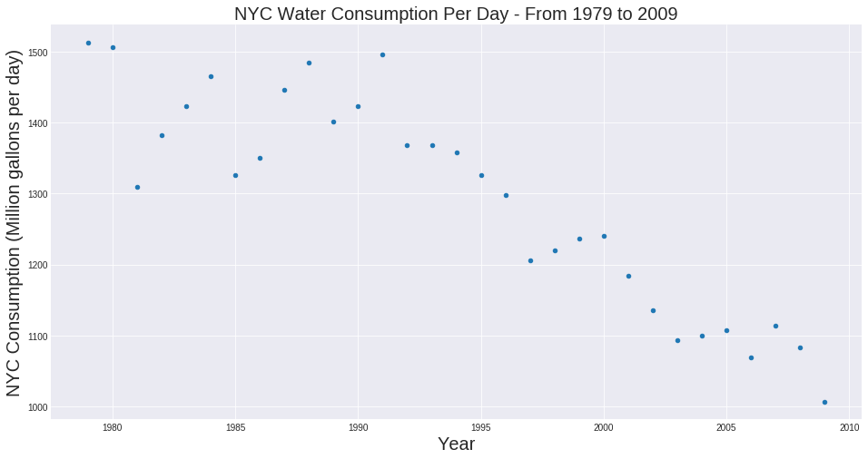

Peer review of Data Viz for iuk202

CLARITY:

The plot has a clearly labeled title for the x and y axis. The time frame and the unit of measure for the quantities (gallons per day for each year in NYC) is clear. One note is the gallons per day appear to be an average per day for each year, making that more clear would be useful.

# FBB tick numbers are very small

ESTHETIC: 

The esthetic is simple, clear functional. There could be yearly tick marks to help idnetify interesting years between the major x-axis tick marks for every 5 years. A trendline may help the figure imply illistrate change from year to year and allow for comparrion.

HONESTY: 

The plot appears honest in representing trends in water consumption. The figure could benefit from a trendline to show the decrease over time and perhaps the markers used could be larger to fill up the open space of the figure.

# FBB a plot like this should have errorbars: the errorbars could be the standard deviation, since the measurement is the average. This would allow to understand if the differences from year to year are significant

# FBB good 10/10
